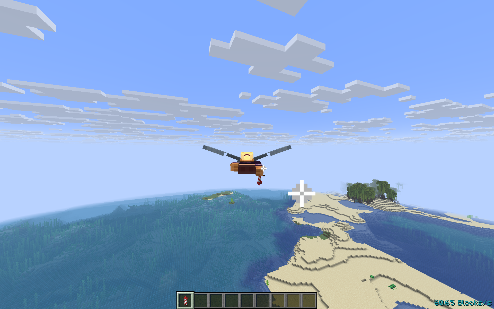

# Elytra Tuning

[](https://modrinth.com/mod/elytra-tuning)
[](https://modrinth.com/mod/elytra-tuning)
[](https://modrinth.com/mod/elytra-tuning)

A lightweight mod that adds configuration options to **limit** elytra flight speed and **change** firework boost **strength** and **duration**.

Works in both **singleplayer** and **multiplayer**, with an optional client-side mod that offers additional improvements for players.

> Ideal for multiplayer servers that want to **nerf elytra rushing**, **reduce chunk-loading lag**, or **buff late-game travel**.

## Why Use This Mod?

1. **Configurable Speed Limits**:
   Limit either horizontal flight speed or total three-dimensional velocity.
2. **Firework Tuning**:
   Adjust both the strength and duration of firework boosts.
3. **Impenetrable**:
   The server syncs the velocity changes to each player, ensuring all experience the same limits or buffs.
4. **Compatible**:
   Handles normal flight, firework boosting, riptide launches, and modded flight setups such as **Do a Barrel Roll**.

## How It Works

Minecraft calculates elytra flight **server-side**, while the client predicts motion **locally**.
To apply the configured speed limits and firework tuning:

- **Server Side**:
  Enforces the configured speed limits and adjusts firework boost strength and duration.
- **Client Side (optional)**:
  Mirrors these settings locally to keep flight prediction consistent.

> **Note**:
> Without the mod on the client, players might experience visual stutter or lag back because their local speed and firework prediction can differ from the server.

## Configuration

A config file is created at:

```sh
./config/elytra-tuning.json
```

Default contents:

```json
{
  "speed": {
    "max": 60.0,
    "calculation": "HORIZONTAL"
  },
  "rocket": {
    "strength": 1.0,
    "duration": 1.0
  }
}
```

- `speed`
  - `max`: Maximum allowed elytra speed in **blocks per second**.
  - `calculation`: `HORIZONTAL` measures `X/Z` movement; `ABSOLUTE` measures total `X/Y/Z` velocity.
- `rocket`
  - `strength`: `0.0` disables acceleration, `1.0` is vanilla strength, and higher values add stronger forward acceleration.
  - `duration`: `1.0` is vanilla duration, `0.5` halves it, and `2.0` doubles it.
- Set `speed` or `rocket` to `null` to not apply any tuning.
- After editing, **restart the server/game** to apply changes.

## Showcase

### Speed Limiting

**Configuration**

```json
{
  "speed": {
    "max": 10.0,
    "calculation": "HORIZONTAL"
  },
  "rocket": null
}
```

> **Rocket Boosting**: Measured in-game speed is 9.90 blocks per second.
>
> 

> **Riptide Trident**: Measured in-game speed is 9.99 blocks per second.
>
> 

### Firework Tuning

**Configuration**

```json
{
  "speed": null,
  "rocket": {
    "strength": 8.0,
    "duration": 2.0
  }
}
```

> **Rocket Boosting:** Measured in-game speed is 60.65 blocks per second.
>
> 

## Contributing & Issues

I warmly welcome:

- Bug reports
- Feature requests
- Pull requests

Please open issues or PRs on [GitHub](https://github.com/nwrenger/elytra-tuning/issues).

## License

This project is licensed under the **LGPLv3 License**. See [LICENSE](https://github.com/nwrenger/elytra-tuning/blob/main/LICENSE) for details.
